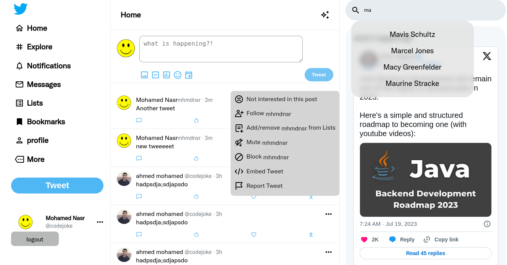

# Fake twitter project

This is a fake twitter project for an internship in ITI ❤️

## Table of contents

- [Fake twitter project](#fake-twitter-project)
  - [Table of contents](#table-of-contents)
  - [Overview](#overview)
    - [The challenge](#the-challenge)
    - [Screenshot](#screenshot)
    - [Links](#links)
  - [My process](#my-process)
    - [Built with](#built-with)
    - [What I learned](#what-i-learned)
    - [Continued development](#continued-development)
    - [Useful resources](#useful-resources)
  - [Author](#author)

## Overview

### The challenge

Users should be able to:

- Shows them explanations to validate their entries (whether they are new or pre-existing entries).
- Save registration information in (local storage) including their profile picture
- Log in with your saved data
- He creates new tweets, saves them, and then restores them if he logs back in
- Dummy search for users
- Delete any tweet you don't like
- Infinite scrolling
- This PWA can run on multiple platforms and this website can be installed on its own device

### Screenshot

### Links

- Solution URL: [Github](https://github.com/mhmdnsr-dev/Twitter)
- Live Site URL: [live site URL](https://fake-twitter-ten.vercel.app/)

## My process

### Built with

- Semantic HTML5 markup
- Flexbox
- CSS Nesting
- CSS Grid
- Javascript
- Placeholder api
- Progressive web app (PWA)

### What I learned

- Data (images) storage in local storage
- CSS Nesting
- FileReader - Web APIs
- ValidityState - Web APIs

### Continued development

### Useful resources

- [MDN web Docs](https://developer.mozilla.org/en-US/)

## Author

- ITI - [@ITI](https://iti.gov.eg/iti/home)
- Mohamed Nasr- [Linkedin](https://www.linkedin.com/in/mhmdnsr-dev/)
- Ahmed Mohamed - [GitHub](https://github.com/AhmedMohamed17)
- Muhammad Shaker - [GitHub](https://github.com/MuhammadShakerAlKilany)
